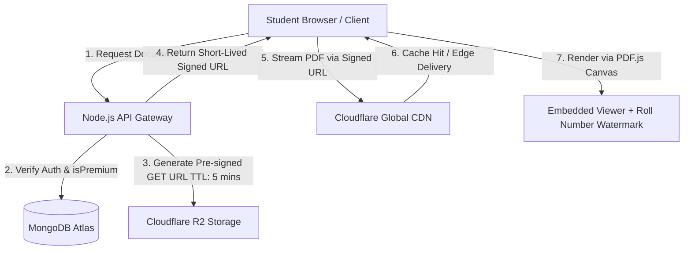
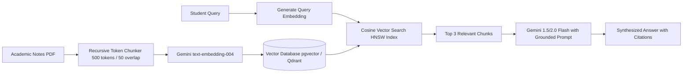
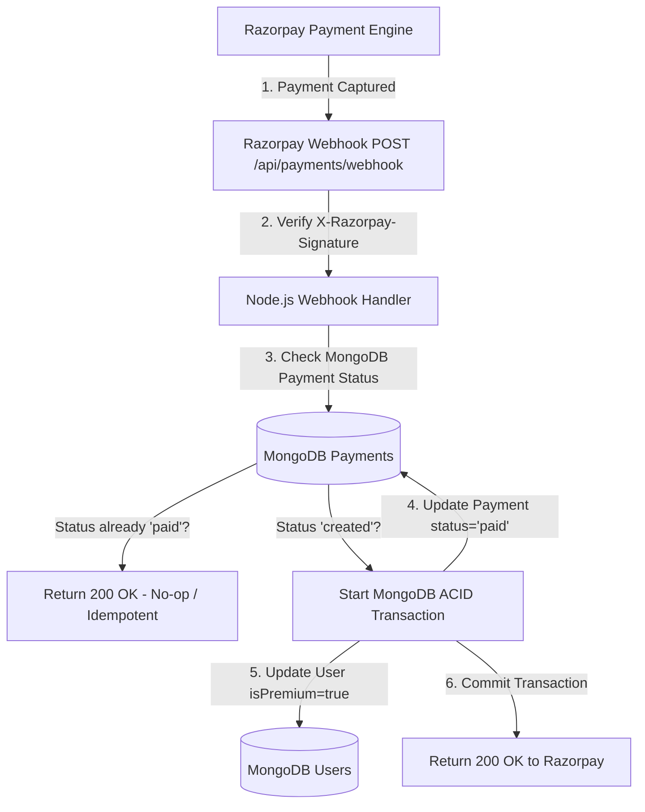
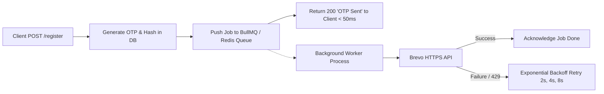
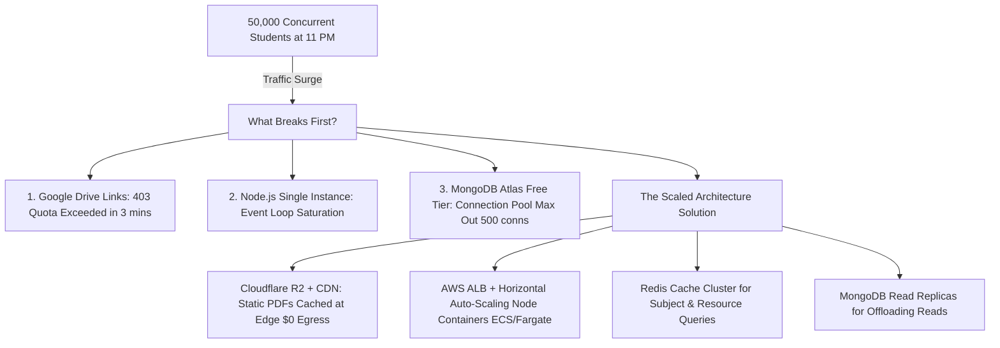

# 🛡️ EduStack — Master Interview Cross-Examination & Architecture Defense Guide

> **Target Roles:** Full-Stack Developer, Backend Engineer (Node.js/MERN), SDE-1 / SDE-2  
> **Core Objective:** Prepare you to defend every single architectural decision, acknowledge trade-offs, survive aggressive interviewer grilling, and articulate battle-tested future production roadmaps.

---

## 📑 Table of Contents

1. [Deep-Dive: The Google Drive Problem & The Future Storage Roadmap](#1-deep-dive-the-google-drive-problem--the-future-storage-roadmap)
2. [Cross-Examination 1: Storage & Media Pipeline (Google Drive vs Cloudflare R2 / AWS S3)](#2-cross-examination-1-storage--media-pipeline)
3. [Cross-Examination 2: Database Architecture (MongoDB Atlas vs PostgreSQL / Relational SQL)](#3-cross-examination-2-database-architecture)
4. [Cross-Examination 3: Frontend Choice (Vanilla JS + Tailwind CSS vs React / Next.js)](#4-cross-examination-3-frontend-choice)
5. [Cross-Examination 4: Polyglot Architecture (Node.js Gateway + Python FastAPI Microservice)](#5-cross-examination-4-polyglot-architecture)
6. [Cross-Examination 5: AI & RAG Engine (In-Memory LightRAGStore vs Vector DBs & Embeddings)](#6-cross-examination-5-ai--rag-engine)
7. [Cross-Examination 6: DSA Sync Engine (Google Sheets CSV Pipeline vs Dedicated DB / CMS)](#7-cross-examination-6-dsa-sync-engine)
8. [Cross-Examination 7: Auth, JWT & Session Security (Dual-Token Rotation, httpOnly, CSRF vs XSS)](#8-cross-examination-7-auth-jwt--session-security)
9. [Cross-Examination 8: Payment Gateway & Money (Razorpay Frontend Verification vs Webhooks & Idempotency)](#9-cross-examination-8-payment-gateway--money)
10. [Cross-Examination 9: Email & Cloud Infrastructure (Brevo REST API vs Nodemailer SMTP on Render)](#10-cross-examination-9-email--cloud-infrastructure)
11. [Cross-Examination 10: Security & Cryptography (Bcrypt DoS, NoSQL Injection, Timing Attacks)](#11-cross-examination-10-security--cryptography)
12. [Cross-Examination 11: The "Exam Night" Scale Test (1,000 to 50,000 Concurrent Students)](#12-cross-examination-11-the-exam-night-scale-test)
13. [Quick-Fire Summary Cheat Sheet (The 30-Second Defenses)](#13-quick-fire-summary-cheat-sheet)

---

## 1. Deep-Dive: The Google Drive Problem & The Future Storage Roadmap

### 🚨 The Problem: Why Google Drive Fails at Scale

In EduStack MVP, learning materials (lecture notes and PYQs) are stored as raw Google Drive links in the `Resource` collection (`models/resource.js`):

```javascript
// models/resource.js
url: {
  type: String,
  required: [true, 'Resource URL is required'], // Google Drive shareable URL
}
```

When user traffic scales from 50 college peers to 10,000+ university students, **four catastrophic failure modes occur**:

1. **Bandwidth Quota Exhaustion (The 24-Hour Block):**
   - Google Drive enforces strict anti-abuse download limits on public links. When hundreds of students download a 25MB PYQ PDF simultaneously before an exam, Google returns:
     > *"Download quota exceeded for this file, so you cannot download it at this time."* (HTTP 403 / 429).
   - Once triggered, the file is locked for **up to 24 hours**.

2. **Authorization Bypass & Piracy Leak (Broken Paywall):**
   - In EduStack, resources have an `isPremium: true` flag.
   - However, if the resource is a raw Google Drive URL, **a single student who pays ₹5 can copy the Google Drive link and paste it into a 5,000-member college Telegram/WhatsApp group**.
   - Everyone gets the file for free without authentication, completely destroying platform monetization.

3. **Link Rot & Contributor Dependency:**
   - If a student contributor deletes the file from their personal Google Drive, moves it to another folder, revokes public sharing, or runs out of their free 15GB Google storage, the link in EduStack permanently dies (HTTP 404).
   - EduStack has no ownership or control over the actual binary asset.

4. **Bloated UX & Zero Ingestion:**
   - Redirecting students to Google Drive's bulky web preview breaks user immersion, loads slowly on 4G/3G campus connections, and prevents on-platform PDF text indexing or AI summarization.

---

### 🚀 The Future Production Plan: What You Must Tell the Interviewer

> **Interview Pitch Formula:**  
> *"In our MVP, we intentionally started with Google Drive links to validate user engagement with zero cloud storage costs. However, our production roadmap migrates all document assets to an **S3-compatible Object Storage (specifically Cloudflare R2) paired with Cloudflare CDN, Pre-signed Expiring URLs, and an Embedded PDF.js Client Viewer with Dynamic Watermarking**."*



#### Why Cloudflare R2 Instead of AWS S3?
- **Zero Egress Bandwidth Fees:** AWS S3 charges ~$0.09 per GB of outbound data transferred to the internet. On exam night, 50,000 students downloading 10MB PDFs = **500 GB egress = $45+ per night on AWS S3**. Cloudflare R2 has **$0 egress fees**, making it massively cheaper for high-bandwidth educational platforms.
- **S3 API Compatibility:** R2 uses the standard AWS S3 SDK (`@aws-sdk/client-s3`), meaning zero code rewrites if switching to AWS S3 or MinIO later.

#### Key Architectural Pillars of the Migration:
1. **Pre-signed Uploads (Direct-to-R2):**
   - Contributors never upload large PDFs through our Node.js server (which would saturate server RAM and block the single-threaded event loop).
   - Instead, the client requests a Pre-signed `PUT` URL from Node.js, and the browser uploads the PDF directly to Cloudflare R2.
2. **Pre-signed Expiring Downloads (5-Minute TTL):**
   - For premium and protected notes, Node.js checks `user.isPremium` and issues a cryptographically signed URL valid for only **5 minutes**.
   - If a student copies and pastes the link into WhatsApp, the link expires in 300 seconds and returns HTTP 403 Access Denied to anyone else.
3. **Embedded PDF.js Viewer + Dynamic Watermarking:**
   - Rather than letting users download raw PDF binaries directly, EduStack renders the document inside an embedded canvas using `PDF.js`.
   - The canvas dynamically overlays a faint, semi-transparent watermark across every page with the logged-in student's **Email + Roll Number + Timestamp**. If a student screenshots or prints it, the leaker is instantly identifiable.

---

## 2. Cross-Examination 1: Storage & Media Pipeline

### Interviewer Attack:
> *"I see you used Cloudinary for images, but for notes and PYQs you just saved Google Drive links in MongoDB. Why didn't you upload notes directly to Cloudinary or your Node.js server disk?"*

#### Candidate Initial Answer:
"We didn't use server disk because Render uses an **ephemeral filesystem** where local uploads are wiped on every container restart. We chose not to put 50MB academic PDFs on Cloudinary because Cloudinary's free tier has strict storage limits (25GB bandwidth/storage credits) tailored for image and video transformations, not large multi-page PDF document hosting."

#### Interviewer Counter-Grill:
> *"Fair enough. But using raw Google Drive links is basically an MVP shortcut. What happens if a contributor replaces the note with a malicious phishing PDF, or deletes it? How do you monitor health, virus scanning, and availability of these links?"*

#### Candidate Knockout Response:
"You are spot on—relying on third-party Drive links poses a link rot and security risk. In our current architecture, we mitigated this operationally through our **Contributor Moderation Pipeline**: links are not published immediately; they must be inspected and approved by an admin.

However, for production scaling, our roadmap transitions to **Cloudflare R2 Object Storage with an automated ingestion pipeline**:
1. **Direct Pre-signed PUT Uploads:** Contributors upload directly to an R2 staging bucket using a temporary signed URL generated by our API.
2. **Asynchronous Antivirus & Sanitation Worker:** An AWS Lambda or background BullMQ worker runs ClamAV to scan uploaded PDFs for embedded malware/macros and checks page counts and metadata using `pypdf`.
3. **Automated Link Checker Cron:** For legacy external links (like YouTube playlists or documentation), we run a background cron job that issues `HEAD` requests every Sunday at midnight. Any link returning 404 or 403 automatically flags the resource in MongoDB with `isBroken: true` and notifies the admin dashboard."

---

## 3. Cross-Examination 2: Database Architecture

### Interviewer Attack:
> *"University curriculum is inherently relational: A University has Branches, a Branch has Semesters, a Semester has Subjects, a Subject has Units, and a Unit has Resources. Why did you use MongoDB instead of PostgreSQL or MySQL? Isn't SQL a far better fit with FOREIGN KEY constraints and cascade deletes?"*

#### Candidate Initial Answer:
"While university structures can be represented relationally, educational content within those structures is **polymorphic and heterogeneous**. A 'Lecture Note' has a file URL and page count; a 'PYQ' has exam year, semester, and question type; a 'Playlist' has a YouTube playlist ID and duration; a 'Platform' has problem tags. In MongoDB, a single `Resource` collection easily stores varied BSON metadata without creating 5 different SQL tables or dealing with sparse columns with hundreds of `NULL` values."

#### Interviewer Counter-Grill:
> *"PostgreSQL supports JSONB with indexing, so polymorphic schemas are no longer an excuse. In MongoDB, if an admin deletes a `Subject`, what happens to all the `Resource` documents referencing it? You don't have FOREIGN KEY cascade deletes. Don't you end up with orphaned resources cluttering your database?"*

#### Candidate Knockout Response:
"That's a valid concern. In MongoDB, we prevent orphaned documents using two specific patterns:
1. **Mongoose Middleware Hooks (`pre('remove')` / `pre('findOneAndDelete')`):**
   In our `subjectSchema`, we attach a hook that deletes associated resources before the subject itself is removed:
   ```javascript
   subjectSchema.pre('findOneAndDelete', async function(next) {
     const doc = await this.model.findOne(this.getQuery());
     if (doc) {
       await mongoose.model('Resource').deleteMany({ subject: doc._id });
       await mongoose.model('Enrollment').deleteMany({ subject: doc._id });
     }
     next();
   });
   ```
2. **Soft Deletes in Production:**
   In real production systems, hard-deleting curriculum data is dangerous. We use soft-deletes (`isDeleted: true`, `deletedAt: Date`) so that accidentally deleted subjects can be restored without corrupting historical student progress or view metrics.
3. **Why MongoDB Still Won for EduStack:**
   Beyond schema flexibility, MongoDB's **native TTL indexes** (`expires: 600` on OTPs and session tokens) allowed us to handle automatic expiration directly at the database engine level with zero extra infrastructure (like Redis or separate cron workers) during early development."

---

## 4. Cross-Examination 3: Frontend Choice

### Interviewer Attack:
> *"You built EduStack with Vanilla HTML, CSS, and Vanilla JavaScript with a 1,849-line `partials.js` file. Nobody builds modern web apps in Vanilla JS anymore. Isn't this unmaintainable, prone to DOM race conditions, and lack of component encapsulation compared to React or Next.js?"*

#### Candidate Initial Answer:
"We deliberately chose Vanilla JS and Tailwind CSS for two primary reasons:
1. **Zero Bundle Overhead on Slow College Networks:** React or Next.js ships 200KB–800KB of JavaScript runtime before the user sees a single byte of content. EduStack was piloted for students on spotty campus Wi-Fi and congested 4G mobile networks. Vanilla JS delivers near-instant **First Contentful Paint (FCP < 600ms)** because the browser parses native HTML immediately.
2. **Deep Demonstrable Web Fundamentals:** Using Vanilla JS forces you to master core DOM APIs, Event Delegation, Closures, and asynchronous fetch lifecycles without hiding behind framework abstractions."

#### Interviewer Counter-Grill:
> *"That sounds great in theory, but when your application grows to 50 pages with shared state (user auth, dark mode, notification badges, dynamic filters), manual DOM manipulation becomes spaghetti code with memory leaks from uncleaned event listeners. How did you structure your Vanilla JS to prevent this?"*

#### Candidate Knockout Response:
"To prevent spaghetti code, we structured `partials.js` around a **Component Lifecycle and Event Delegation Architecture**:
1. **Event Delegation on Root Containers:** Instead of attaching hundreds of individual event listeners to dynamic list items (which causes memory leaks), we attach a single listener to the parent container:
   ```javascript
   document.getElementById('resource-list').addEventListener('click', (e) => {
     const button = e.target.closest('[data-action]');
     if (!button) return;
     const action = button.dataset.action;
     const id = button.dataset.id;
     handleAction(action, id);
   });
   ```
2. **Centralized Auth & State Store:** In `partials.js`, we maintain a single-flight promise for auth status (`window.authPromise = fetch('/api/auth/me')`). Any component needing user state awaits the same promise rather than firing duplicate redundant HTTP requests.
3. **Migration Roadmap:** If scaling the frontend to a rich collaborative application (e.g., live collaborative code editor or student chat), our production plan is to adopt **Vite + React with TypeScript**, breaking `partials.js` into isolated, type-safe React components."

---

## 5. Cross-Examination 4: Polyglot Architecture

### Interviewer Attack:
> *"You built a polyglot architecture: Node.js/Express for the core API and Python/FastAPI for AI services. Isn't maintaining two separate runtimes, two `package.json`/`requirements.txt`, and two deployment pipelines total over-engineering for a college project? Why didn't you just use `pdf-parse` in Node and call the Google Gemini API directly from Node.js?"*

#### Candidate Initial Answer:
"We split them to protect Node's single-threaded event loop. Parsing 50-to-100-page academic PDF syllabi and performing text tokenization in Node.js is CPU-intensive. If a student uploads a large PDF, Node's event loop blocks, freezing HTTP requests for all other students trying to browse notes or log in. Delegating CPU-bound document processing to Python FastAPI on Uvicorn keeps the core Node server responsive."

#### Interviewer Counter-Grill:
> *"Node.js has Worker Threads (`worker_threads`) and child processes for CPU-bound tasks. You didn't need a whole separate microservice just for PDF parsing. Now you've introduced network latency between Node and Python, double point-of-failure, and inter-service network overhead. How do you justify this?"*

#### Candidate Knockout Response:
"While Worker Threads can handle CPU offloading in Node, the decision goes beyond simple CPU utilization:
1. **AI/ML Ecosystem Superiority:** Document intelligence, chunking algorithms, optical character recognition (OCR), and LangChain/LlamaIndex frameworks are native and mature in Python. Python's `pypdf` operates cleanly in pure memory buffers without native C++ compilation issues that frequently crash `pdf-parse` or `canvas` bindings on containerized Linux hosts (Render).
2. **Independent Scalability:** In production, AI requests represent only ~5% of traffic but consume 90% of memory and CPU. With a microservice architecture, we can scale Python FastAPI instances independently on GPU/high-memory worker nodes, while keeping 10 lightweight Node.js API gateway instances on low-cost memory tiers.
3. **Blast Radius Isolation (Fault Tolerance):** If an uploaded PDF is malformed, triggers an Out-Of-Memory (OOM) error, or Gemini times out, only the Python process fails. The Node gateway catches the `ECONNREFUSED` or timeout, returns a `503 AI Service Unavailable` toast to the frontend, and the primary website, payment flow, and study notes remain **100% operational**."

---

## 6. Cross-Examination 5: AI & RAG Engine

### Interviewer Attack:
> *"In `ml_services/main.py`, you have a class called `LightRAGStore`. But looking at your code, it's just an in-memory Python list with keyword overlap matching (`set(query.lower().split())`). That is NOT Retrieval-Augmented Generation (RAG)—that's just a basic keyword filter. Why are you calling it RAG?"*

#### Candidate Initial Answer:
"You are completely correct. `LightRAGStore` in its current form is an **MVP lightweight mock store** designed specifically to run within Render's free tier (512MB RAM limit) without incurring vector database infrastructure costs or blowing up container memory during prototype evaluation."

#### Interviewer Counter-Grill:
> *"Keyword search fails completely on semantic queries. If a student asks 'How to prevent dirty reads in transactions?', your keyword search will fail if the document says 'Isolation levels and concurrency control'. What happens when you have 10,000 pages of notes? Will your in-memory list cause Python to crash with an Out-Of-Memory (OOM) error? What is your real production RAG plan?"*

#### Candidate Knockout Response:
"That is the exact limitation of lexical/keyword matching. Our documented production roadmap replaces `LightRAGStore` with a **Production Semantic RAG Architecture**:



1. **Chunking Strategy:** Split academic documents into 500-token chunks with 50-token overlapping windows using LangChain's `RecursiveCharacterTextSplitter` to preserve paragraph context across chunk boundaries.
2. **Embedding Model:** Generate dense 768-dimensional vector representations using Google's `text-embedding-004` API.
3. **Vector Database:** Store embeddings and metadata in **Qdrant Cloud** or **PostgreSQL with `pgvector`** utilizing an HNSW (Hierarchical Navigable Small World) index for sub-10ms approximate nearest neighbor (ANN) retrieval.
4. **Hybrid Search (Sparse + Dense):** Combine dense vector cosine similarity with BM25 keyword matching (Reciprocal Rank Fusion) so that exact technical keywords (like function names or formulas) and conceptual semantics are both accurately retrieved.
5. **Anti-Hallucination Guardrails:** Prompt Gemini with strict system instructions: *'Answer using ONLY the retrieved context. If the context does not contain the answer, state that the material does not cover this topic.'*"

---

## 7. Cross-Examination 6: DSA Sync Engine

### Interviewer Attack:
> *"In your DSA sheet feature, you fetch data from a public Google Sheets CSV export. Using a spreadsheet as a database is a notorious anti-pattern. What if someone changes a column name, adds trailing commas, or exceeds Google's rate limits?"*

#### Candidate Initial Answer:
"We used Google Sheets not as a database, but as a **Zero-Deployment CMS for Non-Technical Contributors**. Student problem curators and faculty mentors update problem URLs, company tags, and video solution links in a familiar spreadsheet without needing database admin access or git pull requests."

#### Interviewer Counter-Grill:
> *"What happens if Google Sheets API is down, or someone accidentally makes the sheet private, or 500 students load the DSA tracker at 9:00 AM for placement practice? Won't you hit Google rate limits and crash the page?"*

#### Candidate Knockout Response:
"We engineered a **3-Tier Fault-Tolerant Caching & Fallback Pipeline** in `server/app.js` specifically to neutralize these risks:
1. **Tier 1: In-Memory Cache (`_dsaSheetCache`):** The parsed problem set is cached in server RAM with a 5-minute TTL. 99.9% of user requests are served directly from RAM in `< 5ms`, never touching Google Sheets.
2. **Tier 2: Robust State-Machine CSV Parser (`parseCSVText`):**
   Instead of a naive `line.split(',')` which breaks on commas inside quotes (e.g. `"Google, Amazon"` in company tags), we implemented a custom character-by-character state machine handling quoted fields, escaped characters, and schema sanitization.
3. **Tier 3: Disk Fallback (`parsed_problems.json`):**
   If Google Sheets is private, deleted, or times out, the `fetch` throws an exception. Our catch block immediately falls back to reading `parsed_problems.json` (448KB snapshot) stored on server disk.
   **The user never sees an error screen or broken table.**
4. **Future Migration:** Once problem contributions stabilize, we will migrate DSA problems into MongoDB with a dedicated admin portal, retaining Google Sheets only as a bulk CSV import/export utility."

---

## 8. Cross-Examination 7: Auth, JWT & Session Security

### Interviewer Attack:
> *"You store JWT access tokens in `httpOnly` cookies to protect against XSS. But cookies are automatically sent with every cross-origin request by the browser, making your app vulnerable to CSRF (Cross-Site Request Forgery). Did you implement CSRF tokens? And why do you query MongoDB on every request in `isAuth`? Doesn't that defeat the entire point of stateless JWTs?"*

#### Candidate Initial Answer:
"For CSRF protection, we configured `sameSite` cookie attributes (`sameSite: 'strict'` or `'lax'` in same-origin deployments). And in `isAuth`, we query `User.findById` to prevent **Stale Authorization State**—if an admin bans a student or revokes contributor access, stateless JWTs alone wouldn't know until the 15-minute token expired."

#### Interviewer Counter-Grill:
> *"If you query MongoDB on every single request, your JWT is NOT stateless—you are using it as an expensive session ID while paying the CPU cost of cryptographic signature verification (`jwt.verify`) on every request. Why didn't you just use traditional Redis session IDs?"*

#### Candidate Knockout Response:
"That is a deep architectural trade-off, and here is the exact rationale:
1. **Why Dual-Token JWT Was Chosen:**
   In early development and deployment on Render free tier, adding a standalone Redis cluster increases operational complexity, failure points, and hosting costs.
   Our Dual-Token approach gives us the best balance:
   - The **15-minute Access Token** handles short-lived authentication.
   - The **Refresh Token** (hashed with SHA-256 in MongoDB) enables long-lived sessions (30 days) and supports **Automatic Replay Attack Detection**: if an old refresh token is reused, all active sessions for that user are instantly revoked.
2. **How We Scale the DB Lookup in Production:**
   To eliminate the MongoDB query on every HTTP request without sacrificing immediate revocation:
   - We store the user's role and permission version (`tokenVersion: Number`) directly in the JWT payload.
   - We maintain a **Redis distributed cache** of revoked user IDs or updated token versions.
   - The `isAuth` middleware verifies the JWT signature locally in `< 1ms`, checks the in-memory Redis blacklist only for revoked tokens ($O(1)$ lookup in `< 2ms`), and completely skips querying MongoDB Atlas.
3. **CSRF Mitigation:**
   In production, we enforce the **Double Submit Cookie pattern** or custom headers (`X-Requested-With: XMLHttpRequest`). Browsers enforce that malicious cross-site scripts cannot forge custom headers without explicit CORS preflight (`OPTIONS`) approval."

---

## 9. Cross-Examination 8: Payment Gateway & Money

### Interviewer Attack:
> *"In `server/controllers/paymentController.js`, your payment verification relies on the frontend posting `razorpay_payment_id` and `razorpay_signature` to `/api/payments/verify`. What happens if a student pays ₹5 via UPI, their bank account is debited, and before Razorpay redirects back to your frontend, the student's phone dies, browser crashes, or internet drops? Money was deducted, but your server never received the verify request. The student did NOT get Premium access!"*

#### Candidate Initial Answer:
"That is a known client-side edge-case in payment gateway redirects. If the browser closes before calling `/api/payments/verify`, the payment record in our database remains in the `'created'` state, and the user's `isPremium` flag is not updated."

#### Interviewer Counter-Grill:
> *"In a real financial app, that causes angry customer support tickets and chargebacks. Why didn't you use Razorpay Webhooks? And if you do use webhooks, how do you handle webhook race conditions where both the webhook and the frontend verify API hit your server at the exact same millisecond?"*

#### Candidate Knockout Response:
"In production financial engineering, the client redirect is strictly for UI feedback—the **server-to-server Webhook is the single source of financial truth**.

Here is our documented architecture to handle this flawlessly:



1. **Razorpay Webhook Endpoint (`/api/payments/webhook`):**
   Razorpay's servers send an asynchronous `payment.captured` event directly to our backend over HTTPS. Even if the user's phone explodes, the webhook arrives.
2. **Webhook Signature Verification:**
   We verify the `X-Razorpay-Signature` header against our `RAZORPAY_WEBHOOK_SECRET` using `crypto.timingSafeEqual()` to ensure the webhook was not spoofed.
3. **Idempotency & Concurrency Locking:**
   To handle the race condition where the frontend `/verify` and the webhook arrive simultaneously:
   - We wrap the update in a **MongoDB Session Transaction** (`session.withTransaction()`).
   - We perform an atomic condition:
     ```javascript
     const payment = await Payment.findOneAndUpdate(
       { razorpayOrderId, status: { $ne: 'paid' } },
       { status: 'paid', razorpayPaymentId },
       { new: true, session }
     );
     if (payment) {
       await User.findByIdAndUpdate(payment.user, { isPremium: true }, { session });
     }
     ```
   - Whichever request completes first updates the status; the second request sees `{ status: 'paid' }`, commits a no-op, and returns HTTP 200 without double-crediting or duplicate processing."

---

## 10. Cross-Examination 9: Email & Cloud Infrastructure

### Interviewer Attack:
> *"In `mailService.js`, you have a 3-tier email cascade: Brevo HTTPS REST API -> Resend -> Nodemailer SMTP. If Brevo fails or times out, your server tries Resend, then tries Nodemailer. If each external API times out after 10 seconds, the user waiting for an OTP on the signup form is blocked for 30 seconds! Isn't sequential fallback a terrible user experience?"*

#### Candidate Initial Answer:
"We built the 3-tier cascade because Render's free tier strictly blocks outbound SMTP ports (25, 465, 587) to prevent spam, causing standard Nodemailer to fail. Brevo via HTTPS REST on Port 443 solved this. The fallback was intended as redundancy so developers on localhost could use Nodemailer while cloud deployments used Brevo."

#### Interviewer Counter-Grill:
> *"Understood, but doing third-party network I/O synchronously inside an HTTP request cycle violates basic backend design principles. What happens if Brevo rate limits you during college orientation week when 500 students sign up in 10 minutes?"*

#### Candidate Knockout Response:
"You are completely right—synchronous third-party I/O in the request-response lifecycle creates latency and risks worker starvation.

Our production architecture replaces synchronous dispatch with an **Asynchronous Background Message Queue**:



1. **Sub-50ms API Response:** When the user clicks 'Register', the server generates the OTP, saves it to MongoDB, enqueues an `email-dispatch` job to **BullMQ**, and immediately responds to the user: `{ success: true, message: 'OTP sent' }`. The user is never blocked.
2. **Exponential Backoff & Rate Limit Handling:** The background worker consumes jobs independently. If Brevo returns a 429 (Rate Limited), BullMQ automatically retries the job with exponential backoff (e.g., retry in 2s, 4s, 8s) without dropping emails.
3. **Dead-Letter Queue (DLQ):** If an email fails after 3 retries, it moves to a Dead-Letter Queue for alerting and manual replay, ensuring zero lost OTPs."

---

## 11. Cross-Examination 10: Security & Cryptography

### Interviewer Attack:
> *"You use `bcryptjs` with 12 salt rounds for password hashing. Bcrypt is intentionally CPU-heavy (~250-300ms per computation). If an attacker launches a distributed script sending 50 concurrent login requests with random passwords every second, your single-threaded Node.js CPU will reach 100% saturation and crash. Did you accidentally create a Denial of Service (DoS) vulnerability?"*

#### Candidate Initial Answer:
"Bcrypt's computational cost is a deliberate security feature to protect against offline GPU brute-force dictionary attacks. To prevent attackers from abusing login to saturate CPU, we placed strict rate limiting on our authentication routes using `express-rate-limit` (max 10 login attempts per 15-minute window per IP)."

#### Interviewer Counter-Grill:
> *"IP-based rate limiting is easily bypassed using rotating proxies, botnets, or mobile carrier CGNAT where thousands of legitimate students share a single public IP. How do you defend against Bcrypt CPU exhaustion under a distributed attack?"*

#### Candidate Knockout Response:
"That is a classic vulnerability known as **Resource Exhaustion via Proof-of-Work Abuse**. Here is how we defend against it at scale:
1. **Pre-Validation Cheap Filters Before Calling Bcrypt:**
   Before invoking `bcrypt.compare()` (which costs 250ms of CPU), we run ultra-fast memory/DB checks:
   - Validate email format with regex ($< 0.01\text{ms}$).
   - Query the user record. If the user does not exist, we return immediately (or use a constant-time dummy hash to prevent user enumeration without running full bcrypt rounds).
   - Check an in-memory Redis token-bucket per user account (e.g., max 5 attempts per email address regardless of source IP).
2. **Cloudflare Bot Management & Captcha Challenge:**
   At the network edge, Cloudflare Web Application Firewall (WAF) analyzes client TLS fingerprints and browser heuristics. If suspicious automated traffic patterns hit `/api/auth/login`, Cloudflare serves an interactive Turnstile or Managed Challenge before the traffic ever reaches our Node.js server.
3. **Offloading Hashing to Dedicated Worker Threads:**
   Instead of running bcrypt on Node's main threadpool, bcryptjs can run on dedicated background worker threads (`worker_threads`), preventing authentication traffic from blocking standard API routes."

---

## 12. Cross-Examination 11: The "Exam Night" Scale Test

### The Ultimate System Design Interview Question:
> *"It's 11:00 PM the night before the Computer Networks semester exam. 50,000 engineering students open EduStack simultaneously to download PYQs and notes. Walk me through what breaks first in your current architecture, and how you re-architect it to survive."*



#### Step 1: The Failure Cascade (Honest Triage)
1. **First Failure (Minute 2): Google Drive Links**
   - Google Drive's public download quota limits kick in after ~100–200 rapid downloads of the same file. 49,800 students see *"Download quota exceeded"*.
2. **Second Failure (Minute 4): MongoDB Connection Pool Exhaustion**
   - 50,000 students refreshing `/api/subjects` and `/api/resources` saturate Mongoose's default connection pool (`maxPoolSize: 100`). Requests queue up, hit timeout, and return HTTP 500 errors.
3. **Third Failure (Minute 6): Node.js CPU & Memory Saturation**
   - A single Render container runs out of RAM serving concurrent requests and static files.

#### Step 2: The Production Scaled Architecture
1. **Asset Decoupling to Edge (Cloudflare R2 + CDN):**
   - All PDF notes and PYQs are stored in Cloudflare R2.
   - Cloudflare CDN caches the PDF files at hundreds of edge points of presence (PoPs) worldwide. When 50,000 students download the Computer Networks PYQ, **only 1 request hits R2; the remaining 49,999 requests are served directly from Cloudflare edge caches**. Node.js and MongoDB see zero traffic for file downloads.
2. **Redis Caching Layer for Read-Heavy Queries:**
   - 99% of exam night traffic is read-only (fetching subjects and resource lists).
   - We cache the JSON response for `/api/resources/subject/:id` in **Redis** with a 1-hour TTL:
     ```javascript
     const cached = await redis.get(`subject:${id}:resources`);
     if (cached) return res.json(JSON.parse(cached));
     ```
   - MongoDB load drops by **98%**.
3. **Horizontal Auto-Scaling (Stateless Nodes):**
   - Because our Node.js app uses **stateless JWTs** stored in cookies, any server instance can authenticate any request without sticky sessions.
   - We deploy Node.js containers behind an Application Load Balancer (AWS ALB) with an auto-scaling policy: scale from 2 containers to 20 containers when average CPU exceeds 65%.

---

## 13. Quick-Fire Summary Cheat Sheet (The 30-Second Defenses)

| Component | The Common Interviewer Trap | Your Winning 30-Second Defense |
|---|---|---|
| **Google Drive** | *"Why use Drive links instead of S3?"* | *"MVP trade-off for zero-cost rapid validation. Production roadmap is Cloudflare R2 (zero egress fees) + Pre-signed expiring URLs (5-min TTL) to prevent link sharing + PDF.js canvas with student roll number watermarks."* |
| **MongoDB** | *"Why not PostgreSQL for relational curriculum?"* | *"Curriculum resources are heterogeneous/polymorphic (notes, PYQs, videos, platforms). MongoDB BSON handles varied schemas cleanly. Orphaned documents are prevented via Mongoose pre-delete middleware hooks."* |
| **Vanilla JS** | *"Isn't Vanilla JS unmaintainable without React?"* | *"Deliberate optimization for instant First Contentful Paint (FCP) on slow college Wi-Fi by eliminating framework bundle overhead. Structured using event delegation and centralized async promises to avoid DOM leaks."* |
| **Node + Python** | *"Why two backends instead of a single Node monolith?"* | *"Isolates CPU-intensive PDF parsing and tokenization from Node's single-threaded event loop. Ensures AI timeouts or crashes never bring down core authentication, payment, or notes browsing."* |
| **LightRAGStore** | *"Isn't this just in-memory keyword search?"* | *"Yes, an MVP mock store for Render's 512MB RAM limit. Production roadmap uses LangChain recursive chunking (500 tokens), `text-embedding-004`, and Qdrant/pgvector HNSW index for true semantic Cosine similarity."* |
| **Google Sheets** | *"Using a spreadsheet as a database is bad practice."* | *"It functions as a zero-deployment CMS for non-technical student curators. Protected by a 3-tier fallback: In-Memory Cache (5-min TTL) -> Live Google Sync -> Local disk `parsed_problems.json` snapshot."* |
| **httpOnly Cookies** | *"What about CSRF attacks?"* | *"Guarded by `SameSite: strict/lax` policy and HTTPS. Preferred over `localStorage` because XSS token theft is unpreventable once JavaScript is executed, whereas CSRF can be blocked at the network/header boundary."* |
| **Razorpay Verification** | *"What if the user closes the browser before verify runs?"* | *"Client verify is for immediate UI feedback. Production financial consistency relies on Razorpay Webhooks (`payment.captured`) with `X-Razorpay-Signature` validation and atomic DB idempotency locks."* |
| **Brevo vs Nodemailer** | *"Why use an external REST API instead of SMTP?"* | *"Cloud platforms like Render block outbound SMTP ports (25, 465, 587) to prevent spam. Brevo operates over HTTPS Port 443, immune to cloud blocks, with 3-tier fallback to Resend and Nodemailer."* |
| **Bcrypt 12 Rounds** | *"Doesn't 12 rounds leave you vulnerable to CPU DoS?"* | *"Mitigated by aggressive IP rate-limiting on auth routes, rapid pre-validation filters before hashing, and offloading CPU computation to background worker threads."* |

---

*Authored for EduStack Technical Interview Defense, System Design Grilling & Architectural Mastery.*
